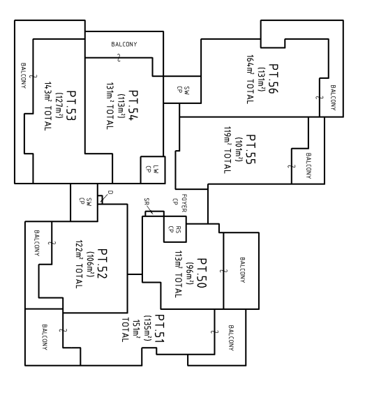

© 2022 The Law Society of New South Wales ACN 000 000 699 and The Real Estate Institute of New South Wales ACN 000 012 457 You can prepare your own version of pages 1 - 4 of this contract. Except as permitted under the Copyright Act 1968 (Cth) or consented to by the copyright owners (including by way of guidelines issued from time to time), no other part of this contract may be reproduced without the specific written permission of The Law Society of New South Wales and The Real Estate Institute of New South Wales.

Contract for the sale and purchase of land 2022 edition

| TERM                                                                                                                                                                                                                                                                                                                                                                                               | MEANING OF TERM                                                                                                                                                           | NSW DAN:                                               |           |             |            |                 |
|----------------------------------------------------------------------------------------------------------------------------------------------------------------------------------------------------------------------------------------------------------------------------------------------------------------------------------------------------------------------------------------------------|---------------------------------------------------------------------------------------------------------------------------------------------------------------------------|--------------------------------------------------------|-----------|-------------|------------|-----------------|
| vendor's agent                                                                                                                                                                                                                                                                                                                                                                                     | Elders Real Estate 3/1 Aldgate Street, Prospect, NSW 2148  Australia                                                                                                      | Phone: (02) 9631 8222                                  |           |             |            |                 |
| co-agent vendor                                                                                                                                                                                                                                                                                                                                                                                    | CHUNXING SUN                                                                                                                                                              |                                                        |           |             |            |                 |
| vendor's solicitor                                                                                                                                                                                                                                                                                                                                                                                 | Veronica Liu Conveyancing                                                                                                                                                 | Phone: 0430922266 Email: info@vliu.com.au Ref: VL:2549 |           |             |            |                 |
| PO Box 1011, Auburn NSW 1835                                                                                                                                                                                                                                                                                                                                                                       |                                                                                                                                                                           |                                                        |           |             |            |                 |
| date for completion                                                                                                                                                                                                                                                                                                                                                                                | 42nd day after the contract date                                                                                                                                          | (clause 15)                                            |           |             |            |                 |
| land (address,  plan details and  title reference)                                                                                                                                                                                                                                                                                                                                                 | 35/5-15 Belair Close, Hornsby, New South Wales 2077 Registered Plan: Lot 35 Plan SP 89350 Folio Identifier 35/SP89350 ☐ VACANT POSSESSION ☐ subject to existing tenancies |                                                        |           |             |            |                 |
| improvements                                                                                                                                                                                                                                                                                                                                                                                       | ☐ HOUSE                                                                                                                                                                   | ☐ garage                                               | ☐ carport | ☒ home unit | ☒ carspace | ☐ storage space |
| ☐ none                                                                                                                                                                                                                                                                                                                                                                                             | ☐ other:                                                                                                                                                                  |                                                        |           |             |            |                 |
| attached copies                                                                                                                                                                                                                                                                                                                                                                                    | ☐ documents in the List of Documents as marked or as numbered: ☐ other documents:                                                                                         |                                                        |           |             |            |                 |
| A real estate agent is permitted by legislation to fill up the items in this box in a sale of residential property. inclusions ☐ air conditioning ☐ clothes line ☐ fixed floor coverings ☐ range hood ☐ blinds ☐ curtains ☐ insect screens ☐ solar panels ☐ built-in wardrobes ☐ dishwasher ☐ light fittings ☐ stove ☐ ceiling fans ☐ EV charger ☐ pool equipment ☐ TV antenna ☐ other: exclusions |                                                                                                                                                                           |                                                        |           |             |            |                 |

exclusions purchaser purchaser's solicitor contract date (if not stated, the date this contract was made)
Where there is more than one purchaser ☐ JOINT TENANTS
☐ tenants in common ☐ in unequal shares, specify: 
GST AMOUNT (optional) The price includes GST of: $ buyer's agent Note: Clause 20.15 provides "Where this contract provides for choices, a choice in BLOCK CAPITALS applies unless a different choice is marked."
price deposit balance
(10% of the price, unless otherwise stated)
2 Land - **2022 Edition**

| SIGNING PAGE VENDOR                                                                                                                 | PURCHASER                                                                                                                           |                           |                           |
|-------------------------------------------------------------------------------------------------------------------------------------|-------------------------------------------------------------------------------------------------------------------------------------|---------------------------|---------------------------|
| Signed by                                                                                                                           | Signed by                                                                                                                           |                           |                           |
|                                                                                                                                     | ___________________                                                                                                                 |                           |                           |
| Vendor                                                                                                                              |                                                                                                                                     | ___________________       |                           |
| Purchaser                                                                                                                           |                                                                                                                                     |                           |                           |
| ___________________ Vendor                                                                                                          | ___________________ Purchaser                                                                                                       |                           |                           |
| VENDOR (COMPANY)                                                                                                                    | PURCHASER (COMPANY)                                                                                                                 |                           |                           |
| Signed by  in accordance with s127(1) of the Corporations Act 2001 by the  authorised person(s) whose signature(s) appear(s) below: | Signed by  in accordance with s127(1) of the Corporations Act 2001 by the  authorised person(s) whose signature(s) appear(s) below: |                           |                           |
| ________________________ Signature of authorised person                                                                             | ________________________ Signature of authorised person                                                                             |                           |                           |
| _______________________ Signature of authorised person                                                                              | ________________________ Signature of authorised person                                                                             |                           |                           |
| Name of authorised person                                                                                                           | Name of authorised person                                                                                                           | Name of authorised person | Name of authorised person |
| Office held                                                                                                                         | Office held                                                                                                                         | Office held               | Office held               |

Vendor agrees to accept a *deposit-bond* ☐ NO ☐ yes Nominated *Electronic Lodgment Network (ELN)* (clause 4)
Manual *transaction* (clause 30) ☐ NO ☐ yes
(if yes, vendor must provide further details, including any applicable exemption, in the space below):
BREACH OF COPYRIGHT MAY RESULT IN LEGAL ACTION
Choices Tax information (the *parties* promise this is correct as far as each *party* **is aware)**
Land tax is adjustable ☐ NO ☐ yes GST: Taxable supply ☐ NO ☐ yes in full ☐ yes to an extent Margin scheme will be used in making the taxable supply ☐ NO ☐ yes This sale is not a taxable supply because (one or more of the following may apply) the sale is:
☐ not made in the course or furtherance of an enterprise that the vendor carries on (section 9-5(b)) ☐ by a vendor who is neither registered nor required to be registered for GST (section 9-5(d)) ☐ GST-free because the sale is the supply of a going concern under section 38-325 ☐ GST-free because the sale is subdivided farm land or farm land supplied for farming under Subdivision 38-O
☒ input taxed because the sale is of eligible residential premises (sections 40-65, 40-75(2) and 195-1)
Purchaser must make an *GSTRW payment* ☐ NO ☐ yes (if yes, vendor must provide
(GST residential withholding payment) details)
If the details below are not fully completed at the contract date, the vendor must provide all these details in a separate notice at least 7 days before the date for completion.

GSTRW payment (GST residential withholding payment) - **details**
Frequently the supplier will be the vendor. However, sometimes further information will be required as to which entity is liable for GST, for example, if the supplier is a partnership, a trust, part of a GST group or a participant in a GST joint venture.

Supplier's name: Supplier's ABN: Supplier's GST branch number (if applicable): Supplier's business address: Supplier's representative: Supplier's contact phone number: Supplier's proportion of *GSTRW payment*:
If more than one supplier, provide the above details for each supplier.

Amount purchaser must pay - price multiplied by the *GSTRW rate* (residential withholding rate): 
Amount must be paid: ☐ AT COMPLETION ☐ at another time (specify): Is any of the consideration not expressed as an amount in money? ☐ NO ☐ yes If "yes", the GST inclusive market value of the non-monetary consideration: $
Other details (including those required by regulation or the ATO forms):

| List of Documents                                                                                                                                                                                                                                                                                                                                                                                                                                                                                                                                                                                                                                                                                                                                                                                                                                                                                                                                                                                                                                                                                                                                                                                                                                                                                                                                                                                                                                                                                                                     |                                                                                                                                                                                                                                                                                                                                                                                                                                                                                                                                                                                                                                                                                                                                                                                                                                                                                                                                                                                                                                                                                                                                                                                                                                                                                                                                        |
|---------------------------------------------------------------------------------------------------------------------------------------------------------------------------------------------------------------------------------------------------------------------------------------------------------------------------------------------------------------------------------------------------------------------------------------------------------------------------------------------------------------------------------------------------------------------------------------------------------------------------------------------------------------------------------------------------------------------------------------------------------------------------------------------------------------------------------------------------------------------------------------------------------------------------------------------------------------------------------------------------------------------------------------------------------------------------------------------------------------------------------------------------------------------------------------------------------------------------------------------------------------------------------------------------------------------------------------------------------------------------------------------------------------------------------------------------------------------------------------------------------------------------------------|----------------------------------------------------------------------------------------------------------------------------------------------------------------------------------------------------------------------------------------------------------------------------------------------------------------------------------------------------------------------------------------------------------------------------------------------------------------------------------------------------------------------------------------------------------------------------------------------------------------------------------------------------------------------------------------------------------------------------------------------------------------------------------------------------------------------------------------------------------------------------------------------------------------------------------------------------------------------------------------------------------------------------------------------------------------------------------------------------------------------------------------------------------------------------------------------------------------------------------------------------------------------------------------------------------------------------------------|
| General ☐ 1 property certificate for the land ☐ 2 plan of the land ☐ 3 unregistered plan of the land ☐ 4 plan of land to be subdivided ☐ 5 document that is to be lodged with a relevant plan ☒ 6 section 10.7(2) planning certificate under  Environmental Planning and Assessment Act 1979 ☐ 7 additional information included in that certificate under section 10.7(5) ☒ 8 sewerage infrastructure location diagram (service location diagram) ☒ 9 sewer lines location diagram (sewerage service diagram) ☐ 10 document that created or may have created an easement, profit à prendre, restriction on use or  positive covenant disclosed in this contract ☐ 11 planning agreement ☐ 12 section 88G certificate (positive covenant) ☐ 13 survey report ☐ 14 building information certificate or building certificate given under legislation ☐ 15 occupation certificate ☐ 16 lease (with every relevant memorandum or variation) ☐ 17 other document relevant to tenancies ☐ 18 licence benefiting the land ☐ 19 old system document ☐ 20 Crown purchase statement of account ☐ 21 building management statement ☐ 22 form of requisitions  ☐ 23 clearance certificate ☐ 24 land tax certificate Home Building Act 1989 ☐ 25 insurance certificate ☐ 26 brochure or warning ☐ 27 evidence of alternative indemnity cover Swimming Pools Act 1992 ☐ 28 certificate of compliance ☐ 29 evidence of registration ☐ 30 relevant occupation certificate  ☐ 31 certificate of non-compliance ☐ 32 detailed reasons of non-compliance | Strata or community title (clause 23 of the contract) ☒ 33 property certificate for strata common property ☒ 34 plan creating strata common property ☐ 35 strata by-laws ☐ 36 strata development contract or statement ☐ 37 strata management statement ☐ 38 strata renewal proposal ☐ 39 strata renewal plan ☐ 40 leasehold strata - lease of lot and common property ☐ 41 property certificate for neighbourhood property ☐ 42 plan creating neighbourhood property ☐ 43 neighbourhood development contract ☐ 44 neighbourhood management statement ☐ 45 property certificate for precinct property ☐ 46 plan creating precinct property ☐ 47 precinct development contract ☐ 48 precinct management statement ☐ 49 property certificate for community property ☐ 50 plan creating community property ☐ 51 community development contract ☐ 52 community management statement ☐ 53 document disclosing a change of by-laws ☐ 54 document disclosing a change in a development or management contract or statement ☐ 55 document disclosing a change in boundaries ☐ 56 information certificate under Strata Schemes Management Act 2015 ☐ 57 information certificate under Community Land Management Act 2021 ☐ 58 disclosure statement - off the plan contract ☐ 59 other document relevant to the off the plan contract Other ☐ 60 |

HOLDER OF STRATA OR COMMUNITY SCHEME RECORDS - **Name, address, email address and telephone** 
number Westside Strata Management PO Box 241, FAIRFIELD NSW 1860 Phone: 9791 9933 strata@westside.net.au IMPORTANT NOTICE TO VENDORS AND PURCHASERS Before signing this contract you should ensure **that you understand your** 
rights and obligations, some of which are not written in this contract but are implied by law.

## Warning—Smoke Alarms

The owners of certain types of buildings and strata lots must have smoke alarms, or in certain cases heat alarms, installed in the building or lot in accordance with regulations under the Environmental Planning and Assessment Act 1979. It is an offence not to comply. It is also an offence to remove or interfere with a smoke alarm or heat alarm. Penalties apply.

HORNSBY NSW 2077 WARNING—LOOSE-FILL ASBESTOS INSULATION
Before purchasing land that includes residential premises, within the meaning of the *Home Building Act 1989,* Part 8, Division 1A, **built before** 1985, a purchaser is strongly advised to consider the possibility that the premises may contain loose-fill asbestos insulation, within the meaning of the *Home Building Act 1989*, Part 8, Division 1A. **In particular, a purchaser** 
should— CL 
(a) search the Register required to be maintained under the *Home* Building Act 1989, Part 8, Division 1A, and
(b) **ask the relevant local council whether it holds records showing that** 
the residential premises contain loose-fill asbestos insulation.

35/5-15 BELAIR 
For further information about loose-fill asbestos insulation, **including areas** 

in which residential premises have been identified as containing loose-fill asbestos insulation, contact NSW Fair Trading. 

Cooling off period (purchaser's rights)
1 This is the statement required by the *Conveyancing Act 1919***, section** 
66X. This statement **applies to a contract for the sale of residential** property.

2 **EXCEPT in the circumstances listed in paragraph 3, the purchaser** 
may rescind the contract before 5pm on— (a) for an off the plan contract—the tenth business day after the day on which the contract was made, or
(b) **in any other case—the fifth business day after the day on which** 
the contract was made.

HORNSBY NSW 2077 3 There is NO COOLING OFF PERIOD—
(a) **if, at or before the time the contract is made, the purchaser gives** 
to the vendor, or the vendor's solicitor or agent, **a certificate that** complies with the Act, section 66W, or
(b) **if the property is sold by public auction, or** (c) if the contract is made on the same day as the property was offered for sale by public auction but passed in, or
(d) if the contract is made in consequence of the exercise of an option to purchase the property, other than an option that is void under the Act, section 66ZG.

CL 
4 A purchaser exercising the right to cool off by rescinding the contract forfeits 0.25% of the purchase price of the property to the vendor.

5 **The vendor is entitled to recover the forfeited amount from an amount** 
paid by the purchaser as a deposit under the contract. The **purchaser** 
is entitled to a refund of any balance.

## Disputes

35/5-15 BELAIR 
If you get into a dispute with the other party, the Law Society and Real Estate Institute encourage you to use informal procedures such as negotiation, independent expert appraisal, the Law Society Conveyancing Dispute Resolution Scheme or mediation (for example mediation under the Law Society Mediation Program).

## Auctions

Regulations made under the Property and Stock Agents Act 2002 **prescribe a** number of conditions applying to sales by auction.

| WARNINGS   |
|------------|

1. Various Acts of Parliament and other matters can affect the rights of the parties to this contract. Some important matters are actions, claims, decisions, licences, notices, orders, proposals or rights of way involving: APA Group Australian Taxation Office Council County Council Department of Planning and Environment Department of Primary Industries Electricity and gas Land and Housing Corporation Local Land Services NSW Department of Education NSW Fair Trading Owner of adjoining land Privacy Public Works Advisory Subsidence Advisory NSW Telecommunications Transport for NSW Water, sewerage or drainage authority If you think that any of **these matters affects the property, tell your solicitor**.

HORNSBY NSW 2077 2. A lease may be affected by the Agricultural Tenancies Act 1990, the Residential Tenancies Act 2010 **or the Retail Leases Act 1994.**
3. **If any purchase money is owing to the Crown, it will become payable before** 
obtaining consent, or if no consent is needed, when the transfer is registered.

4. If a consent to transfer is required under legislation, see clause 27 as to the obligations of the parties.

5. The vendor should continue the vendor's insurance until completion. If the vendor wants to give the purchaser possession before completion, the vendor should first ask the insurer to confirm this will not affect the insurance.

CL 
35/5-15 BELAIR 
6. **Most purchasers will have to pay transfer duty (and, sometimes, if the purchaser is** 
not an Australian citizen, surcharge purchaser duty) on this contract. Some purchasers may be eligible to choose to pay first home buyer choice property tax instead of transfer duty. If a payment is not made on time, interest and penalties may be incurred.

7. **If the purchaser agrees to the release of deposit, the purchaser's right to recover the** 
deposit may stand behind the rights of others (for example the vendor's mortgagee).

8. **The purchaser should arrange insurance as appropriate.** 9. **Some transactions involving personal property may be affected by the Personal** 
Property Securities Act 2009.

10. A purchaser should be satisfied that finance will be available at the time of completing the purchase.

11. Where the market value of the property is at or above a legislated amount, the purchaser may have to comply with a foreign resident capital gains withholding payment obligation (even if the vendor is not a foreign resident). If so, this will affect the amount available to the vendor on completion.

12. **Purchasers of some residential properties may have to withhold part of the purchase** 
price to be credited towards the GST liability of the vendor. If so, this will also affect the amount available to the vendor. More information is available from the ATO.

The vendor sells and the purchaser buys the *property* for the price under these provisions instead of Schedule 3 Conveyancing Act 1919, subject to any *legislation* that cannot be excluded.

| Conveyancing Act 1919, subject to any legislation that cannot be excluded. 1 Definitions (a term in italics is a defined term) 1.1 In this contract, these terms (in any form) mean - adjustment date the earlier of the giving of possession to the purchaser or completion; adjustment figures details of the adjustments to be made to the price under clause 14; authorised Subscriber a Subscriber (not being a party's solicitor) named in a notice served by a party as  being authorised for the purposes of clause 20.6.8; bank the Reserve Bank of Australia or an authorised deposit-taking institution which is a  bank, a building society or a credit union; business day any day except a bank or public holiday throughout NSW or a Saturday or Sunday; cheque a cheque that is not postdated or stale; clearance certificate a certificate within the meaning of s14-220 of Schedule 1 to the TA Act, that covers  one or more days falling within the period from and including the contract date to  completion; completion time the time of day at which completion is to occur; conveyancing rules the rules made under s12E of the Real Property Act 1900; deposit-bond a deposit bond or guarantee with each of the following approved by the vendor - ● the issuer; - the expiry date (if any); and - the amount; depositholder vendor's agent (or if no vendor's agent is named in this contract, the vendor's  solicitor, or if no vendor's solicitor is named in this contract, the buyer's agent); discharging mortgagee any discharging mortgagee, chargee, covenant chargee or caveator whose  provision of a Digitally Signed discharge of mortgage, discharge of charge or  withdrawal of caveat is required in order for unencumbered title to the property to  be transferred to the purchaser; document of title document relevant to the title or the passing of title; ECNL the Electronic Conveyancing National Law (NSW); electronic document a dealing as defined in the Real Property Act 1900 which may be created and  Digitally Signed in an Electronic Workspace; electronic transaction a Conveyancing Transaction to be conducted for the parties by their legal  representatives as Subscribers using an ELN and in accordance with the ECNL  and the participation rules; electronic transfer a transfer of land under the Real Property Act 1900 for the property to be prepared  and Digitally Signed in the Electronic Workspace established for the purposes of  the parties' Conveyancing Transaction; FRCGW percentage the percentage mentioned in s14-200(3)(a) of Schedule 1 to the TA Act (12.5% as  at 1 July 2017); FRCGW remittance a remittance which the purchaser must make under s14-200 of Schedule 1 to the  TA Act, being the lesser of the FRCGW percentage of the price (inclusive of GST, if  any) and the amount specified in a variation served by a party; GST Act A New Tax System (Goods and Services Tax) Act 1999; GST rate the rate mentioned in s4 of A New Tax System (Goods and Services Tax Imposition  - General) Act 1999 (10% as at 1 July 2000); GSTRW payment a payment which the purchaser must make under s14-250 of Schedule 1 to the TA  Act (the price multiplied by the GSTRW rate); GSTRW rate the rate determined under ss14-250(6), (8) or (9) of Schedule 1 to the TA Act (as at  1 July 2018, usually 7% of the price if the margin scheme applies, 1/11th if not); incoming mortgagee any mortgagee who is to provide finance to the purchaser on the security of the  property and to enable the purchaser to pay the whole or part of the price; legislation an Act or a by-law, ordinance, regulation or rule made under an Act; manual transaction a Conveyancing Transaction in which a dealing forming part of the Lodgment Case at or following completion cannot be Digitally Signed; normally subject to any other provision of this contract; participation rules the participation rules as determined by the ECNL; party each of the vendor and the purchaser; property the land, the improvements, all fixtures and the inclusions, but not the exclusions; planning agreement a valid voluntary agreement within the meaning of s7.4 of the Environmental  Planning and Assessment Act 1979 entered into in relation to the property; populate to complete data fields in the Electronic Workspace; HORNSBY NSW 2077CL 35/5-15 BELAIR BREACH OF COPYRIGHT MAY RESULT IN LEGAL ACTION   |
|----------------------------------------------------------------------------------------------------------------------------------------------------------------------------------------------------------------------------------------------------------------------------------------------------------------------------------------------------------------------------------------------------------------------------------------------------------------------------------------------------------------------------------------------------------------------------------------------------------------------------------------------------------------------------------------------------------------------------------------------------------------------------------------------------------------------------------------------------------------------------------------------------------------------------------------------------------------------------------------------------------------------------------------------------------------------------------------------------------------------------------------------------------------------------------------------------------------------------------------------------------------------------------------------------------------------------------------------------------------------------------------------------------------------------------------------------------------------------------------------------------------------------------------------------------------------------------------------------------------------------------------------------------------------------------------------------------------------------------------------------------------------------------------------------------------------------------------------------------------------------------------------------------------------------------------------------------------------------------------------------------------------------------------------------------------------------------------------------------------------------------------------------------------------------------------------------------------------------------------------------------------------------------------------------------------------------------------------------------------------------------------------------------------------------------------------------------------------------------------------------------------------------------------------------------------------------------------------------------------------------------------------------------------------------------------------------------------------------------------------------------------------------------------------------------------------------------------------------------------------------------------------------------------------------------------------------------------------------------------------------------------------------------------------------------------------------------------------------------------------------------------------------------------------------------------------------------------------------------------------------------------------------------------------------------------------------------------------------------------------------------------------------------------------------------------------------------------------------------------------------------------------------------------------------------------------------------------------------------------------------------------------------------------------------------------------------------------------------------------------------------------------------------------------------------------------------------------------------------------------------------------------------------------------------------------------------------------------------------------------------------------------------------------------------------------------------------------------------------------------------------------------------------------------------------------------------------------------------------------------------------------------------------------------------------------------------------------------------------------------------------------------------------------------------------------------------------------------------------------------------------|

requisition an objection, question or requisition (but the term does not include a claim); rescind rescind this contract from the beginning; serve serve in writing on the other *party*; settlement cheque an unendorsed *cheque* made payable to the person to be paid and –
- issued by a *bank* and drawn on itself; or - if authorised in writing by the vendor or the vendor's *solicitor*, some other cheque; solicitor in relation to a *party*, the *party's* solicitor or licensed conveyancer named in this contract or in a notice *served* by the *party*;
TA Act Taxation Administration Act 1953; terminate terminate this contract for breach; title data the details of the title to the *property* made available to the *Electronic Workspace* by the Land Registry; variation a variation made under s14-235 of Schedule 1 to the *TA Act*; within in relation to a period, at any time before or during the period; and work order a valid direction, notice or order that requires work to be done or money to be spent on or in relation to the *property* or any adjoining footpath or road (but the term does not include a notice under s22E of the Swimming Pools Act 1992 or clause 22 of the Swimming Pools Regulation 2018).

1.2 Words and phrases used in this contract (italicised and in Title Case, such as *Conveyancing Transaction*, 
Digitally Signed, Electronic Workspace, ELN, ELNO, Land Registry, *Lodgment Case* and *Subscriber*) have the meanings given in the *participation rules*.

HORNSBY NSW 2077 2 **Deposit and other payments before completion**
2.1 The purchaser must pay the deposit to the *depositholder* as stakeholder.

2.2 *Normally*, the purchaser must pay the deposit on the making of this contract, and this time is essential. 2.3 If this contract requires the purchaser to pay any of the deposit by a later time, that time is also essential.

2.4 The purchaser can pay any of the deposit by –
2.4.1 giving cash (up to $2,000) to the *depositholder*;
2.4.2 unconditionally giving a *cheque* to the *depositholder* or to the vendor, vendor's agent or vendor's solicitor for sending to the *depositholder*; or 2.4.3 electronic funds transfer to the *depositholder's* nominated account and, if requested by the vendor or the *depositholder*, providing evidence of that transfer. 

2.5 The vendor can *terminate* if –
2.5.1 any of the deposit is not paid on time; 2.5.2 a *cheque* for any of the deposit is not honoured on presentation; or 2.5.3 a payment under clause 2.4.3 is not received in the *depositholder's* nominated account by 5.00 pm on the third *business day* after the time for payment.

This right to *terminate* is lost as soon as the deposit is paid in full.

2.6 If the vendor accepts a *deposit-bond* for the deposit, clauses 2.1 to 2.5 do not apply.

2.7 If the vendor accepts a *deposit-bond* for part of the deposit, clauses 2.1 to 2.5 apply only to the balance. 2.8 If any of the deposit or of the balance of the price is paid before completion to the vendor or as the vendor directs, it is a charge on the land in favour of the purchaser until *termination* by the vendor or completion, subject to any existing right.

2.9 If each *party* tells the *depositholder* that the deposit is to be invested, the *depositholder* is to invest the deposit 
(at the risk of the *party* who becomes entitled to it) with a *bank*, in an interest-bearing account in NSW, 
payable at call, with interest to be reinvested, and pay the interest to the *parties* equally, after deduction of all proper government taxes and financial institution charges and other charges.

CL 
35/5-15 BELAIR 
3 **Deposit-bond** 3.1 This clause applies only if the vendor accepts a *deposit-bond* for the deposit (or part of it). 3.2 The purchaser must provide the *deposit-bond* to the vendor's *solicitor* (or if no solicitor the *depositholder*) at or before the making of this contract and this time is essential.

3.3 If the *deposit-bond* has an expiry date and completion does not occur by the date which is 14 days before the expiry date, the purchaser must *serve* a replacement *deposit-bond* at least 7 days before the expiry date. The time for service is essential.

3.4 The vendor must approve a replacement *deposit-bond* if –
3.4.1 it is from the same issuer and for the same amount as the earlier *deposit-bond;* and 3.4.2 it has an expiry date at least three months after its date of issue.

3.5 A breach of clauses 3.2 or 3.3 entitles the vendor to *terminate*. The right to *terminate* is lost as soon as –
3.5.1 the purchaser *serves* a replacement *deposit-bond*; or 3.5.2 the deposit is paid in full under clause 2.

3.6 Clauses 3.3 and 3.4 can operate more than once. 3.7 If the purchaser *serves* a replacement *deposit-bond*, the vendor must *serve* the earlier *deposit-bond*.

3.8 The amount of any *deposit-bond* does not form part of the price for the purposes of clause 16.5.

3.9 The vendor must give the purchaser any original *deposit-bond* –
3.9.1 on completion; or 3.9.2 if this contract is *rescinded*.

3.10 If this contract is *terminated* by the vendor –
3.10.1 *normally*, the vendor can immediately demand payment from the issuer of the *deposit-bond*; or 3.10.2 if the purchaser *serves* prior to *termination* a notice disputing the vendor's right to *terminate*, the vendor must forward any original *deposit-bond* (or its proceeds if called up) to the *depositholder* as stakeholder.

3.11 If this contract is *terminated* by the purchaser –
3.11.1 *normally*, the vendor must give the purchaser any original *deposit-bond*; or 3.11.2 if the vendor *serves* prior to *termination* a notice disputing the purchaser's right to *terminate*, the vendor must forward any original *deposit-bond* (or its proceeds if called up) to the *depositholder* as stakeholder.

HORNSBY NSW 2077 4 **Electronic transaction**
4.1 This Conveyancing *Transaction* is to be conducted as an electronic *transaction* unless –
4.1.1 the contract says this transaction is a *manual transaction*, giving the reason, or 4.1.2 a party *serves* a notice stating why the transaction is a *manual transaction*, in which case the parties do not have to complete earlier than 14 days after *service* of the notice, and clause 21.3 does not apply to this provision, and in both cases clause 30 applies.

4.2 If, because of clause 4.1.2, this *Conveyancing Transaction* is to be conducted as a manual *transaction* –
4.2.1 each *party* must –
- bear equally any disbursements or fees; and - otherwise bear that *party's* own costs; incurred because this *Conveyancing Transaction* was to be conducted as an *electronic transaction*; and 4.2.2 if a *party* has paid all of a disbursement or fee which, by reason of this clause, is to be borne equally by the *parties*, that amount must be adjusted under clause 14. 

4.3 The *parties* must conduct the *electronic transaction* –
4.3.1 in accordance with the *participation rules* and the *ECNL*; and 4.3.2 using the nominated ELN, unless the *parties* otherwise agree. This clause 4.3.2 does not prevent a party using an ELN which can interoperate with the nominated ELN. 

4.4 A *party* must pay the fees and charges payable by that *party* to the *ELNO* and the *Land Registry*. 4.5 *Normally,* the vendor must *within* 7 days of the contract date create and *populate an Electronic Workspace* with *title data* and the date for completion, and invite the purchaser to the *Electronic Workspace*.

4.6 If the vendor has not created an *Electronic Workspace* in accordance with clause 4.5, the purchaser may create and populate an *Electronic Workspace* and, if it does so, the purchaser must invite the vendor to the Electronic Workspace.

4.7 The *parties* must, as applicable to their role in the *Conveyancing Transaction* and the steps taken under clauses 4.5 or 4.6 - 4.7.1 promptly join the *Electronic Workspace* after receipt of an invitation; 4.7.2 create and populate an *electronic transfer*; 4.7.3 invite any discharging mortgagee or *incoming mortgagee* to join the *Electronic Workspace*; and 4.7.4 *populate* the *Electronic Workspace* with a nominated *completion time*.

4.8 If the transferee in the *electronic transfer* is not the purchaser, the purchaser must give the vendor a direction signed by the purchaser personally for that transfer.

4.9 The vendor can require the purchaser to include a covenant or easement in the *electronic transfer* only if this contract contains the wording of the proposed covenant or easement, and a description of the land burdened and benefited.

4.10 If the purchaser must make a *GSTRW payment* or an *FRCGW remittance*, the purchaser must *populate* the Electronic Workspace with the payment details for the GSTRW payment or *FRCGW remittance* payable to the Deputy Commissioner of Taxation at least 2 *business days* before the date for completion.

4.11 Before completion, the *parties* must ensure that –
4.11.1 all electronic *documents* which a *party* must Digitally *Sign* to complete the electronic *transaction* are populated and Digitally *Signed*; 
4.11.2 all certifications required by the *ECNL* are properly given; and 4.11.3 they do everything else in the Electronic *Workspace* which that *party* must do to enable the electronic *transaction* to proceed to completion. 

4.12 If the computer systems of any of the *Land Registry*, the *ELNO,* Revenue NSW or the Reserve Bank of Australia are inoperative for any reason at the *completion time* agreed by the *parties*, a failure to complete this contract for that reason is not a default under this contract on the part of either *party*. 

CL 
35/5-15 BELAIR 
4.13 If the computer systems of the *Land Registry* are inoperative for any reason at the *completion time* agreed by the *parties,* and the *parties* choose that financial settlement is to occur despite this, then on financial settlement occurring - 4.13.1 all *electronic documents Digitally Signed* by the vendor and any discharge of mortgage, withdrawal of caveat or other *electronic document* forming part of the *Lodgment Case* for the *electronic* transaction are taken to have been unconditionally and irrevocably delivered to the purchaser or the purchaser's mortgagee at the time of financial settlement together with the right to deal with the land; and 4.13.2 the vendor is taken to have no legal or equitable interest in the *property*.

4.14 If the *parties* do not agree about the delivery before completion of one or more documents or things that cannot be delivered through the *Electronic Workspace*, the *party* required to deliver the documents or things - 4.14.1 holds them on completion in escrow for the benefit of; and 4.14.2 must immediately after completion deliver the documents or things to, or as directed by; the *party* entitled to them.

HORNSBY NSW 2077 5 **Requisitions**
5.1 If a form of *requisitions* is attached to this contract, the purchaser is taken to have made those *requisitions*. 5.2 If the purchaser is or becomes entitled to make any other *requisition*, the purchaser can make it only by serving it - 5.2.1 if it arises out of this contract or it is a general question about the *property* or title - *within* 21 days after the contract date; 5.2.2 if it arises out of anything *served* by the vendor - *within* 21 days after the later of the contract date and that *service*; and 5.2.3 in any other case - *within* a reasonable time.

6 **Error or misdescription**
6.1 *Normally*, the purchaser can (but only before completion) claim compensation for an error or misdescription in this contract (as to the *property*, the title or anything else and whether substantial or not).

6.2 This clause applies even if the purchaser did not take notice of or rely on anything in this contract containing or giving rise to the error or misdescription.

6.3 However, this clause does not apply to the extent the purchaser knows the true position.

CL 
7 **Claims by purchaser**
Normally, the purchaser can make a claim (including a claim under clause 6) before completion only by serving it with a statement of the amount claimed, and if the purchaser makes one or more claims before completion –
7.1 the vendor can *rescind* if in the case of claims that are not claims for delay –
7.1.1 the total amount claimed exceeds 5% of the price; 7.1.2 the vendor *serves* notice of intention to *rescind*; and 7.1.3 the purchaser does not *serve* notice waiving the claims *within* 14 days after that *service*; and 7.2 if the vendor does not *rescind*, the *parties* must complete and if this contract is completed –
7.2.1 the lesser of the total amount claimed and 10% of the price must be paid out of the price to and held by the *depositholder* until the claims are finalised or lapse; 7.2.2 the amount held is to be invested in accordance with clause 2.9; 7.2.3 the claims must be finalised by an arbitrator appointed by the *parties* or, if an appointment is not made *within* 1 month of completion, by an arbitrator appointed by the President of the Law Society at the request of a *party* (in the latter case the *parties* are bound by the terms of the Conveyancing Arbitration Rules approved by the Law Society as at the date of the appointment);
7.2.4 the purchaser is not entitled, in respect of the claims, to more than the total amount claimed and the costs of the purchaser; 7.2.5 net interest on the amount held must be paid to the *parties* in the same proportion as the amount held is paid; and 7.2.6 if the *parties* do not appoint an arbitrator and neither *party* requests the President to appoint an arbitrator *within* 3 months after completion, the claims lapse and the amount belongs to the vendor.

35/5-15 BELAIR 

## 8 Vendor'S Rights And Obligations

8.1 The vendor can *rescind* if –
8.1.1 the vendor is, on reasonable grounds, unable or unwilling to comply with a *requisition*; 8.1.2 the vendor *serves* a notice of intention to *rescind* that specifies the *requisition* and those grounds; and 8.1.3 the purchaser does not *serve* a notice waiving the *requisition within* 14 days after that *service*.

8.2 If the vendor does not comply with this contract (or a notice under or relating to it) in an essential respect, the purchaser can terminate by *serving* a notice. After the *termination* –
8.2.1 the purchaser can recover the deposit and any other money paid by the purchaser under this contract; 8.2.2 the purchaser can sue the vendor to recover damages for breach of contract; and 8.2.3 if the purchaser has been in possession a *party* can claim for a reasonable adjustment.

HORNSBY NSW 2077 9 **Purchaser's default**
If the purchaser does not comply with this contract (or a notice under or relating to it) in an essential respect, the vendor can terminate by *serving* a notice. After the *termination* the vendor can –
9.1 keep or recover the deposit (to a maximum of 10% of the price); 9.2 hold any other money paid by the purchaser under this contract as security for anything recoverable under this clause - 9.2.1 for 12 months after the *termination*; or 9.2.2 if the vendor commences proceedings under this clause *within* 12 months, until those proceedings are concluded; and 9.3 sue the purchaser either –
9.3.1 where the vendor has resold the *property* under a contract made *within* 12 months after the termination, to recover –
- the deficiency on resale (with credit for any of the deposit kept or recovered and after allowance for any capital gains tax or goods and services tax payable on anything recovered under this clause); and
- the reasonable costs and expenses arising out of the purchaser's non-compliance with this contract or the notice and of resale and any attempted resale; or 9.3.2 to recover damages for breach of contract.

## 10 Restrictions On Rights Of Purchaser

10.1 The purchaser cannot make a claim or requisition or rescind or *terminate* in respect of –
10.1.1 the ownership or location of any fence as defined in the Dividing Fences Act 1991; 10.1.2 a service for the *property* being a joint service or passing through another property, or any service for another property passing through the *property* ('service' includes air, communication, drainage, electricity, garbage, gas, oil, radio, sewerage, telephone, television or water service);
10.1.3 a wall being or not being a party wall in any sense of that term or the *property* being affected by an easement for support or not having the benefit of an easement for support; 10.1.4 any change in the *property* due to fair wear and tear before completion; 10.1.5 a promise, representation or statement about this contract, the *property* or the title, not set out or referred to in this contract; 10.1.6 a condition, exception, reservation or restriction in a Crown grant; 10.1.7 the existence of any authority or licence to explore or prospect for gas, minerals or petroleum; 10.1.8 any easement or restriction on use the substance of either of which is disclosed in this contract or any non-compliance with the easement or restriction on use; or 10.1.9 anything the substance of which is disclosed in this contract (except a caveat, charge, mortgage, priority notice or writ).

10.2 The purchaser cannot rescind or *terminate* only because of a defect in title to or quality of the inclusions.

10.3 *Normally*, the purchaser cannot make a claim or requisition or rescind or *terminate* or require the vendor to change the nature of the title disclosed in this contract (for example, to remove a caution evidencing qualified title, or to lodge a plan of survey as regards limited title).

CL 
35/5-15 BELAIR 

## 11 Compliance With Work Orders

11.1 *Normally*, the vendor must by completion comply with a work *order* made on or before the contract date and if this contract is completed the purchaser must comply with any other *work order*.

11.2 If the purchaser complies with a *work order*, and this contract is rescinded or *terminated*, the vendor must pay the expense of compliance to the purchaser.

12 **Certificates and inspections**
The vendor must do everything reasonable to enable the purchaser, subject to the rights of any tenant –
12.1 to have the *property* inspected to obtain any certificate or report reasonably required; 12.2 to apply (if necessary in the name of the vendor) for –
12.2.1 any certificate that can be given in respect of the *property* under *legislation*; or 12.2.2 a copy of any approval, certificate, consent, direction, notice or order in respect of the *property* given under *legislation*, even if given after the contract date; and 12.3 to make 1 inspection of the *property* in the 3 days before a time appointed for completion.

## 13 Goods And Services Tax (Gst)

13.1 Terms used in this clause which are not defined elsewhere in this contract and have a defined meaning in the GST Act have the same meaning in this clause.

13.2 *Normally*, if a *party* must pay the price or any other amount to the other *party* under this contract, GST is not to be added to the price or amount.

13.3 If under this contract a *party* must make an adjustment or payment for an expense of another party or pay an expense payable by or to a third party (for example, under clauses 14 or 20.7) –
13.3.1 the *party* must adjust or pay on completion any GST added to or included in the expense; but 13.3.2 the amount of the expense must be reduced to the extent the party receiving the adjustment or payment (or the representative member of a GST group of which that party is a member) is entitled to an input tax credit for the expense; and 13.3.3 if the adjustment or payment under this contract is consideration for a taxable supply, an amount for GST must be added at the *GST rate*.

13.4 If this contract says this sale is the supply of a going concern –
13.4.1 the *parties* agree the supply of the *property* is a supply of a going concern; 13.4.2 the vendor must, between the contract date and completion, carry on the enterprise conducted on the land in a proper and business-like way; 13.4.3 if the purchaser is not registered by the date for completion, the *parties* must complete and the purchaser must pay on completion, in addition to the price, an amount being the price multiplied by the *GST rate* ("the retention sum"). The retention sum is to be held by the *depositholder* and dealt with as follows –
- if *within* 3 months of completion the purchaser *serves* a letter from the Australian Taxation Office stating the purchaser is registered with a date of effect of registration on or before completion, the *depositholder* is to pay the retention sum to the purchaser; but
- if the purchaser does not *serve* that letter *within* 3 months of completion, the *depositholder* is to pay the retention sum to the vendor; and 13.4.4 if the vendor, despite clause 13.4.1, *serves* a letter from the Australian Taxation Office stating the vendor has to pay GST on the supply, the purchaser must pay to the vendor on demand the amount of GST assessed.

13.5 *Normally*, the vendor promises the margin scheme will not apply to the supply of the *property*. 13.6 If this contract says the margin scheme is to apply in making the taxable supply, the *parties* agree that the margin scheme is to apply to the sale of the *property*.

13.7 If this contract says the sale is not a taxable supply –
13.7.1 the purchaser promises that the *property* will not be used and represents that the purchaser does not intend the *property* (or any part of the *property*) to be used in a way that could make the sale a taxable supply to any extent; and 13.7.2 the purchaser must pay the vendor on completion in addition to the price an amount calculated by multiplying the price by the *GST rate* if this sale is a taxable supply to any extent because of –
- a breach of clause 13.7.1; or
- something else known to the purchaser but not the vendor.

13.8 If this contract says this sale is a taxable supply in full and does not say the margin scheme applies to the property, the vendor must pay the purchaser on completion an amount of one-eleventh of the price if –
13.8.1 this sale is not a taxable supply in full; or 13.8.2 the margin scheme applies to the *property* (or any part of the *property*).

13.9 If this contract says this sale is a taxable supply to an extent –
13.9.1 clause 13.7.1 does not apply to any part of the *property* which is identified as being a taxable supply; and 13.9.2 the payments mentioned in clauses 13.7 and 13.8 are to be recalculated by multiplying the relevant payment by the proportion of the price which represents the value of that part of the *property* to which the clause applies (the proportion to be expressed as a number between 0 and 1). Any evidence of value must be obtained at the expense of the vendor.

13.10 *Normally*, on completion the vendor must give the recipient of the supply a tax invoice for any taxable supply by the vendor by or under this contract.

13.11 The vendor does not have to give the purchaser a tax invoice if the margin scheme applies to a taxable supply.

13.12 If the vendor is liable for GST on rents or profits due to issuing an invoice or receiving consideration before completion, any adjustment of those amounts must exclude an amount equal to the vendor's GST liability.

13.13 If the vendor *serves* details of a *GSTRW payment* which the purchaser must make, the purchaser does not have to complete earlier than 5 *business days* after that *service* and clause 21.3 does not apply to this provision.

13.14 If the purchaser must make a *GSTRW payment* the purchaser must, at least 2 *business days* before the date for completion, *serve* evidence of submission of a *GSTRW payment* notification form to the Australian Taxation Office by the purchaser or, if a direction under either clause 4.8 or clause 30.4 has been given, by the transferee named in the transfer the subject of that direction.

HORNSBY NSW 2077 CL 
35/5-15 BELAIR 
15 **Date for completion** 
The *parties* must complete by the date for completion and, if they do not, a *party* can *serve* a notice to complete if that *party* is otherwise entitled to do so.

CL 
17 **Possession** 17.1 *Normally*, the vendor must give the purchaser vacant possession of the *property* on completion.

17.2 The vendor does not have to give vacant possession if –
17.2.1 this contract says that the sale is subject to existing tenancies; and 17.2.2 the contract discloses the provisions of the tenancy (for example, by attaching a copy of the lease and any relevant memorandum or variation).

17.3 *Normally*, the purchaser can claim compensation (before or after completion) or *rescind* if any of the land is affected by a protected tenancy (a tenancy affected by Schedule 2, Part 7 of the Residential Tenancies Act 2010).

14 **Adjustments** 14.1 *Normally*, the vendor is entitled to the rents and profits and will be liable for all rates, water, sewerage and drainage service and usage charges, land tax, levies and all other periodic outgoings up to and including the adjustment date after which the purchaser will be entitled and liable.

14.2 The *parties* must make any necessary adjustment on completion, and –
14.2.1 the purchaser must provide the vendor with *adjustment figures* at least 2 *business days* before the date for completion; and 14.2.2 the vendor must confirm the *adjustment figures* at least 1 *business day* before the date for completion.

14.3 If an amount that is adjustable under this contract has been reduced under *legislation*, the *parties* must on completion adjust the reduced amount.

14.4 The *parties* must not adjust surcharge land tax (as defined in the Land Tax Act 1956) but must adjust any other land tax for the year current at the *adjustment date* –
14.4.1 only if land tax has been paid or is payable for the year (whether by the vendor or by a predecessor in title) and this contract says that land tax is adjustable; 14.4.2 by adjusting the amount that would have been payable if at the start of the year –
- the person who owned the land owned no other land; - the land was not subject to a special trust or owned by a non-concessional company; and - if the land (or part of it) had no separate taxable value, by calculating its separate taxable value on a proportional area basis.

14.5 The *parties* must not adjust any first home buyer choice property tax. 14.6 If any other amount that is adjustable under this contract relates partly to the land and partly to other land, the parties must adjust it on a proportional area basis.

14.7 If on completion the last bill for a water, sewerage or drainage usage charge is for a period ending before the adjustment date, the vendor is liable for an amount calculated by dividing the bill by the number of days in the period then multiplying by the number of unbilled days up to and including the *adjustment date*.

14.8 The vendor is liable for any amount recoverable for work started on or before the contract date on the *property* or any adjoining footpath or road.

HORNSBY NSW 2077 16 **Completion**
- **Vendor**
16.1 *Normally*, on completion the vendor must cause the legal title to the *property* (being the estate disclosed in this contract) to pass to the purchaser free of any charge, mortgage or other interest, subject to any necessary registration.

16.2 The legal title to the *property* does not pass before completion.

16.3 If the vendor gives the purchaser a document (other than the transfer) that needs to be lodged for registration, the vendor must pay the lodgment fee to the purchaser.

16.4 If a party *serves* a land tax certificate showing a charge on any of the land, by completion the vendor must do all things and pay all money required so that the charge is no longer effective against the land.

- **Purchaser**
16.5 On completion the purchaser must pay to the vendor –
16.5.1 the price less any –
- deposit paid; - *FRCGW remittance* payable; - *GSTRW payment*; and - amount payable by the vendor to the purchaser under this contract; and 16.5.2 any other amount payable by the purchaser under this contract.

16.6 If any of the deposit is not covered by a *deposit-bond*, at least 1 *business day* before the date for completion the purchaser must give the vendor an order signed by the purchaser authorising the *depositholder* to account to the vendor for the deposit, to be held by the vendor in escrow until completion.

16.7 On completion the deposit belongs to the vendor.

35/5-15 BELAIR 

## 18 Possession Before Completion

18.1 This clause applies only if the vendor gives the purchaser possession of the *property* before completion.

18.2 The purchaser must not before completion –
18.2.1 let or part with possession of any of the *property*; 18.2.2 make any change or structural alteration or addition to the *property;* or 18.2.3 contravene any agreement between the *parties* or any direction, document, *legislation*, notice or order affecting the *property*.

18.3 The purchaser must until completion –
18.3.1 keep the *property* in good condition and repair having regard to its condition at the giving of possession; and 18.3.2 allow the vendor or the vendor's authorised representative to enter and inspect it at all reasonable times.

18.4 The risk as to damage to the *property* passes to the purchaser immediately after the purchaser enters into possession.

18.5 If the purchaser does not comply with this clause, then without affecting any other right of the vendor –
18.5.1 the vendor can before completion, without notice, remedy the non-compliance; and 18.5.2 if the vendor pays the expense of doing this, the purchaser must pay it to the vendor with interest at the rate prescribed under s101 Civil Procedure Act 2005.

18.6 If this contract is rescinded or *terminated* the purchaser must immediately vacate the *property*. 18.7 If the *parties* or their *solicitors* on their behalf do not agree in writing to a fee or rent, none is payable.

HORNSBY NSW 2077 19 **Rescission of contract** 19.1 If this contract expressly gives a *party* a right to *rescind*, the *party* can exercise the right –
19.1.1 only by *serving* a notice before completion; and 19.1.2 in spite of any making of a claim or *requisition*, any attempt to satisfy a claim or *requisition*, any arbitration, litigation, mediation or negotiation or any giving or taking of possession.

19.2 *Normally*, if a *party* exercises a right to *rescind* expressly given by this contract or any *legislation* –
19.2.1 the deposit and any other money paid by the purchaser under this contract must be refunded; 19.2.2 a *party* can claim for a reasonable adjustment if the purchaser has been in possession; 19.2.3 a *party* can claim for damages, costs or expenses arising out of a breach of this contract; and 19.2.4 a *party* will not otherwise be liable to pay the other *party* any damages, costs or expenses.

CL 
20 **Miscellaneous** 20.1 The *parties* acknowledge that anything stated in this contract to be attached was attached to this contract by the vendor before the purchaser signed it and is part of this contract.

20.2 Anything attached to this contract is part of this contract. 20.3 An area, bearing or dimension in this contract is only approximate. 20.4 If a *party* consists of 2 or more persons, this contract benefits and binds them separately and together. 20.5 A *party's solicitor* can receive any amount payable to the *party* under this contract or direct in writing that it is to be paid to another person.

20.6 A document under or relating to this contract is –
20.6.1 signed by a *party* if it is signed by the *party* or the party's *solicitor* (apart from a direction under clause 4.8 or clause 30.4);
20.6.2 *served* if it is *served* by the *party* or the party's *solicitor*; 20.6.3 *served* if it is *served* on the party's *solicitor*, even if the *party* has died or any of them has died; 20.6.4 *served* if it is *served* in any manner provided in s170 of the Conveyancing Act 1919; 20.6.5 *served* if it is sent by email or fax to the *party's solicitor*, unless in either case it is not received; 20.6.6 *served* on a person if it (or a copy of it) comes into the possession of the person; 20.6.7 *served* at the earliest time it is *served*, if it is *served* more than once; and 20.6.8 *served* if it is provided to or by the *party's solicitor* or an *authorised Subscriber* by means of an Electronic Workspace created under clause 4. However, this does not apply to a notice making an obligation essential, or a notice of rescission or *termination*.

20.7 An obligation to pay an expense of another *party* of doing something is an obligation to pay –
20.7.1 if the *party* does the thing personally - the reasonable cost of getting someone else to do it; or 20.7.2 if the *party* pays someone else to do the thing - the amount paid, to the extent it is reasonable.

20.8 Rights under clauses 4, 11, 13, 14, 17, 24, 30 and 31 continue after completion, whether or not other rights continue.

20.9 The vendor does not promise, represent or state that the purchaser has any cooling off rights. 20.10 The vendor does not promise, represent or state that any attached survey report is accurate or current. 20.11 A reference to any *legislation* (including any percentage or rate specified in *legislation*) is also a reference to any corresponding later *legislation*.

20.12 Each *party* must do whatever is necessary after completion to carry out the *party's* obligations under this contract.

20.13 Neither taking possession nor *serving* a transfer of itself implies acceptance of the *property* or the title.

35/5-15 BELAIR 
20.14 The details and information provided in this contract (for example, on pages 1 - 4) are, to the extent of each party's knowledge, true, and are part of this contract.

20.15 Where this contract provides for choices, a choice in BLOCK CAPITALS applies unless a different choice is marked.

20.16 Each *party* consents to –
20.16.1 any *party* signing this contract electronically; and 20.16.2 the making of this contract by the exchange of counterparts delivered by email, or by such other electronic means as may be agreed in writing by the *parties*.

20.17 Each *party* agrees that electronic signing by a *party* identifies that *party* and indicates that *party's* intention to be bound by this contract.

HORNSBY NSW 2077 21 **Time limits in these provisions** 21.1 If the time for something to be done or to happen is not stated in these provisions, it is a reasonable time.

21.2 If there are conflicting times for something to be done or to happen, the latest of those times applies. 21.3 The time for one thing to be done or to happen does not extend the time for another thing to be done or to happen.

21.4 If the time for something to be done or to happen is the 29th, 30th or 31st day of a month, and the day does not exist, the time is instead the last day of the month.

21.5 If the time for something to be done or to happen is a day that is not a *business day*, the time is extended to the next *business day*, except in the case of clauses 2 and 3.2.

21.6 *Normally*, the time by which something must be done is fixed but not essential. 22 **Foreign Acquisitions and Takeovers Act 1975**
22.1 The purchaser promises that the Commonwealth Treasurer cannot prohibit and has not prohibited the transfer under the Foreign Acquisitions and Takeovers Act 1975.

22.2 This promise is essential and a breach of it entitles the vendor to *terminate*. 23 **Strata or community title**
- **Definitions and modifications**
23.1 This clause applies only if the land (or part of it) is a lot in a strata, neighbourhood, precinct or community scheme (or on completion is to be a lot in a scheme of that kind).

23.2 In this contract –
23.2.1 'change', in relation to a scheme, means –
- a registered or registrable change from by-laws set out in this contract; - a change from a development or management contract or statement set out in this contract; or
- a change in the boundaries of common property; 23.2.2 'common property' includes association property for the scheme or any higher scheme; 23.2.3 'contribution' includes an amount payable under a by-law; 23.2.4 'information certificate' includes a certificate under s184 Strata Schemes Management Act 2015 and s171 Community Land Management Act 2021; 23.2.5 'interest notice' includes a strata interest notice under s22 Strata Schemes Management Act 2015 and an association interest notice under s20 Community Land Management Act 2021; 23.2.6 'normal expenses', in relation to an owners corporation for a scheme, means normal operating expenses usually payable from the administrative fund of an owners corporation for a scheme of the same kind; 23.2.7 'owners corporation' means the owners corporation or the association for the scheme or any higher scheme; 23.2.8 'the *property*' includes any interest in common property for the scheme associated with the lot; and 23.2.9 'special expenses', in relation to an owners corporation, means its actual, contingent or expected expenses, except to the extent they are –
- normal expenses; - due to fair wear and tear; - disclosed in this contract; or
- covered by moneys held in the capital works fund.

23.3 Clauses 11, 14.8 and 18.4 do not apply to an obligation of the owners corporation, or to property insurable by it.

23.4 Clauses 14.4.2 and 14.6 apply but on a unit entitlement basis instead of an area basis.

- **Adjustments and liability for expenses**
23.5 The *parties* must adjust under clause 14.1 –
23.5.1 a regular periodic contribution; 23.5.2 a contribution which is not a regular periodic contribution but is disclosed in this contract; and 23.5.3 on a unit entitlement basis, any amount paid by the vendor for a normal expense of the owners corporation to the extent the owners corporation has not paid the amount to the vendor.

CL 
35/5-15 BELAIR 
23.6 If a contribution is not a regular periodic contribution and is not disclosed in this contract –
23.6.1 the vendor is liable for it if it was determined on or before the contract date, even if it is payable by instalments; and 23.6.2 the purchaser is liable for all contributions determined after the contract date.

23.7 The vendor must pay or allow to the purchaser on completion the amount of any unpaid contributions for which the vendor is liable under clause 23.6.1.

23.8 *Normally*, the purchaser cannot make a claim or requisition or rescind or *terminate* in respect of –
23.8.1 an existing or future actual, contingent or expected expense of the owners corporation; 23.8.2 a proportional unit entitlement of the lot or a relevant lot or former lot, apart from a claim under clause 6; or 23.8.3 a past or future change in the scheme or a higher scheme.

23.9 However, the purchaser can *rescind* if –
23.9.1 the special expenses of the owners corporation at the later of the contract date and the creation of the owners corporation when calculated on a unit entitlement basis (and, if more than one lot or a higher scheme is involved, added together), less any contribution paid by the vendor, are more than 1% of the price; 23.9.2 in the case of the lot or a relevant lot or former lot in a higher scheme, a proportional unit entitlement for the lot is disclosed in this contract but the lot has a different proportional unit entitlement at the contract date or at any time before completion; 23.9.3 a change before the contract date or before completion in the scheme or a higher scheme materially prejudices the purchaser and is not disclosed in this contract; or 23.9.4 a resolution is passed by the owners corporation before the contract date or before completion to give to the owners in the scheme for their consideration a strata renewal plan that has not lapsed at the contract date and there is not attached to this contract a strata renewal proposal or the strata renewal plan.

- **Notices, certificates and inspections**
23.10 Before completion, the purchaser must *serve* a copy of an interest notice addressed to the owners corporation and signed by the purchaser.

23.11 After completion, the purchaser must insert the date of completion in the interest notice and send it to the owners corporation.

23.12 The vendor can complete and send the interest notice as agent for the purchaser. 23.13 The vendor must *serve* at least 7 days before the date for completion, an information certificate for the lot, the scheme or any higher scheme which relates to a period in which the date for completion falls.

23.14 The purchaser does not have to complete earlier than 7 days after *service* of the information certificate and clause 21.3 does not apply to this provision. On completion the purchaser must pay the vendor the prescribed fee for the information certificate.

23.15 The vendor authorises the purchaser to apply for the purchaser's own information certificate. 23.16 The vendor authorises the purchaser to apply for and make an inspection of any record or other document in the custody or control of the owners corporation or relating to the scheme or any higher scheme.

- **Meetings of the owners corporation**
23.17 If a general meeting of the owners corporation is convened before completion –
23.17.1 if the vendor receives notice of it, the vendor must immediately notify the purchaser of it; and 23.17.2 after the expiry of any cooling off period, the purchaser can require the vendor to appoint the purchaser (or the purchaser's nominee) to exercise any voting rights of the vendor in respect of the lot at the meeting.

HORNSBY NSW 2077 CL 
35/5-15 BELAIR 
24 **Tenancies**
24.1 If a tenant has not made a payment for a period preceding or current at the *adjustment date* –
24.1.1 for the purposes of clause 14.2, the amount is to be treated as if it were paid; and 24.1.2 the purchaser assigns the debt to the vendor on completion and will if required give a further assignment at the vendor's expense.

24.2 If a tenant has paid in advance of the *adjustment date* any periodic payment in addition to rent, it must be adjusted as if it were rent for the period to which it relates.

24.3 If the *property* is to be subject to a tenancy on completion or is subject to a tenancy on completion –
24.3.1 the vendor authorises the purchaser to have any accounting records relating to the tenancy inspected and audited and to have any other document relating to the tenancy inspected; 24.3.2 the vendor must *serve* any information about the tenancy reasonably requested by the purchaser before or after completion; and 24.3.3 *normally*, the purchaser can claim compensation (before or after completion) if –
- a disclosure statement required by the Retail Leases Act 1994 was not given when required; - such a statement contained information that was materially false or misleading;
- a provision of the lease is not enforceable because of a non-disclosure in such a statement; or
- the lease was entered into in contravention of the Retail Leases Act 1994.

24.4 If the *property* is subject to a tenancy on completion –
24.4.1 the vendor must allow or transfer –
- any remaining bond money or any other security against the tenant's default (to the extent the security is transferable);
- any money in a fund established under the lease for a purpose and compensation for any money in the fund or interest earnt by the fund that has been applied for any other purpose; and
- any money paid by the tenant for a purpose that has not been applied for that purpose and compensation for any of the money that has been applied for any other purpose; 24.4.2 if the security is not transferable, each *party* must do everything reasonable to cause a replacement security to issue for the benefit of the purchaser and the vendor must hold the original security on trust for the benefit of the purchaser until the replacement security issues; 24.4.3 the vendor must give to the purchaser –
- at least 2 *business days* before the date for completion, a proper notice of the transfer (an attornment notice) addressed to the tenant, to be held by the purchaser in escrow until completion;
- any certificate given under the Retail Leases Act 1994 in relation to the tenancy;
- a copy of any disclosure statement given under the Retail Leases Act 1994;
- a copy of any document served on the tenant under the lease and written details of its service, if the document concerns the rights of the landlord or the tenant after completion; and
- any document served by the tenant under the lease and written details of its service, if the document concerns the rights of the landlord or the tenant after completion; 24.4.4 the vendor must comply with any obligation to the tenant under the lease, to the extent it is to be complied with by completion; and 24.4.5 the purchaser must comply with any obligation to the tenant under the lease, to the extent that the obligation is disclosed in this contract and is to be complied with after completion.

HORNSBY NSW 2077

## 25 Qualified Title, Limited Title And Old System Title

25.1 This clause applies only if the land (or part of it) –
25.1.1 is under qualified, limited or old system title; or 25.1.2 on completion is to be under one of those titles.

25.2 The vendor must *serve* a proper abstract of title *within* 7 days after the contract date. 25.3 If an abstract of title or part of an abstract of title is attached to this contract or has been lent by the vendor to the purchaser before the contract date, the abstract or part is *served* on the contract date.

25.4 An abstract of title can be or include a list of documents, events and facts arranged (apart from a will or codicil) in date order, if the list in respect of each document - 25.4.1 shows its date, general nature, names of parties and any registration number; and 25.4.2 has attached a legible photocopy of it or of an official or registration copy of it.

25.5 An abstract of title –
25.5.1 must start with a good root of title (if the good root of title must be at least 30 years old, this means 30 years old at the contract date);
25.5.2 in the case of a leasehold interest, must include an abstract of the lease and any higher lease; 25.5.3 *normally*, need not include a Crown grant; and 25.5.4 need not include anything evidenced by the Register kept under the Real Property Act 1900.

25.6 In the case of land under old system title –
25.6.1 in this contract 'transfer' means conveyance; 25.6.2 the purchaser does not have to *serve* the transfer until after the vendor has *served* a proper abstract of title; and 25.6.3 each vendor must give proper covenants for title as regards that vendor's interest.

25.7 In the case of land under limited title but not under qualified title –
25.7.1 *normally*, the abstract of title need not include any document which does not show the location, area or dimensions of the land (for example, by including a metes and bounds description or a plan of the land);
25.7.2 clause 25.7.1 does not apply to a document which is the good root of title; and 25.7.3 the vendor does not have to provide an abstract if this contract contains a delimitation plan 
(whether in registrable form or not).

25.8 On completion the vendor must give the purchaser any *document of title* that relates only to the *property*. 25.9 If on completion the vendor has possession or control of a *document of title* that relates also to other property, the vendor must produce it as and where necessary.

25.10 The vendor must give a proper covenant to produce where relevant. 25.11 The vendor does not have to produce or covenant to produce a document that is not in the possession of the vendor or a mortgagee.

25.12 If the vendor is unable to produce an original document in the chain of title, the purchaser will accept a photocopy from the *Land Registry* of the registration copy of that document.

CL 
35/5-15 BELAIR 
26 **Crown purchase money** 26.1 This clause applies only if purchase money is payable to the Crown, whether or not due for payment. 

26.2 The vendor is liable for the money, except to the extent this contract says the purchaser is liable for it. 

26.3 To the extent the vendor is liable for it, the vendor is liable for any interest until completion. 26.4 To the extent the purchaser is liable for it, the *parties* must adjust any interest under clause 14.

27 **Consent to transfer** 27.1 This clause applies only if the land (or part of it) cannot be transferred without consent under *legislation* or a planning agreement.

27.2 The purchaser must properly complete and then *serve* the purchaser's part of an application for consent to transfer of the land (or part of it) *within* 7 days after the contract date.

27.3 The vendor must apply for consent *within* 7 days after *service* of the purchaser's part. 27.4 If consent is refused, either *party* can *rescind*.

27.5 If consent is given subject to one or more conditions that will substantially disadvantage a *party*, then that party can rescind *within* 7 days after receipt by or *service* upon the *party* of written notice of the conditions.

27.6 If consent is not given or refused –
27.6.1 *within* 42 days after the purchaser *serves* the purchaser's part of the application, the purchaser can rescind; or 27.6.2 *within* 30 days after the application is made, either *party* can *rescind*.

27.7 Each period in clause 27.6 becomes 90 days if the land (or part of it) is –
27.7.1 under a *planning agreement*; or 27.7.2 in the Western Division. 

27.8 If the land (or part of it) is described as a lot in an unregistered plan, each time in clause 27.6 becomes the later of the time and 35 days after creation of a separate folio for the lot.

27.9 The date for completion becomes the later of the date for completion and 14 days after *service* of the notice granting consent to transfer.

HORNSBY NSW 2077 28 **Unregistered plan**
28.1 This clause applies only if some of the land is described as a lot in an unregistered plan. 28.2 The vendor must do everything reasonable to have the plan registered *within* 6 months after the contract date, with or without any minor alteration to the plan or any document to be lodged with the plan validly required or made under *legislation*.

28.3 If the plan is not registered *within* that time and in that manner –
28.3.1 the purchaser can *rescind*; and 28.3.2 the vendor can *rescind*, but only if the vendor has complied with clause 28.2 and with any legislation governing the rescission.

28.4 Either *party* can *serve* notice of the registration of the plan and every relevant lot and plan number. 28.5 The date for completion becomes the later of the date for completion and 21 days after *service* of the notice. 28.6 Clauses 28.2 and 28.3 apply to another plan that is to be registered before the plan is registered.

CL 
35/5-15 BELAIR 
29 **Conditional contract**
29.1 This clause applies only if a provision says this contract or completion is conditional on an event. 29.2 If the time for the event to happen is not stated, the time is 42 days after the contract date. 29.3 If this contract says the provision is for the benefit of a *party*, then it benefits only that *party*.

29.4 If anything is necessary to make the event happen, each *party* must do whatever is reasonably necessary to cause the event to happen.

29.5 A *party* can *rescind* under this clause only if the *party* has substantially complied with clause 29.4. 29.6 If the event involves an approval and the approval is given subject to a condition that will substantially disadvantage a *party* who has the benefit of the provision, the *party* can rescind *within* 7 days after either party serves notice of the condition.

29.7 If the *parties* can lawfully complete without the event happening –
29.7.1 if the event does not happen *within* the time for it to happen, a *party* who has the benefit of the provision can rescind *within* 7 days after the end of that time; 29.7.2 if the event involves an approval and an application for the approval is refused, a *party* who has the benefit of the provision can rescind *within* 7 days after either party *serves* notice of the refusal; and 29.7.3 the date for completion becomes the later of the date for completion and 21 days after the earliest of - ● either party *serving* notice of the event happening; - every *party* who has the benefit of the provision *serving* notice waiving the provision; or - the end of the time for the event to happen.

29.8 If the *parties* cannot lawfully complete without the event happening –
29.8.1 if the event does not happen *within* the time for it to happen, either *party* can *rescind*;
29.8.2 if the event involves an approval and an application for the approval is refused, either *party* can rescind; 29.8.3 the date for completion becomes the later of the date for completion and 21 days after either party serves notice of the event happening.

29.9 A *party* cannot *rescind* under clauses 29.7 or 29.8 after the event happens.

HORNSBY NSW 2077 30 Manual **transaction** 30.1 This clause applies if this transaction is to be conducted as a *manual transaction*.

- **Transfer**
30.2 *Normally*, the purchaser must *serve* the transfer at least 7 days before the date for completion.

30.3 If any information needed for the transfer is not disclosed in this contract, the vendor must *serve* it. 30.4 If the purchaser *serves* a transfer and the transferee is not the purchaser, the purchaser must give the vendor a direction signed by the purchaser personally for that transfer.

30.5 The vendor can require the purchaser to include a covenant or easement in the transfer only if this contract contains the wording of the proposed covenant or easement, and a description of the land burdened and benefited.

- **Place for completion**
30.6 *Normally*, the *parties* must complete at the completion address, which is –
30.6.1 if a special completion address is stated in this contract - that address; or 30.6.2 if none is stated, but a first mortgagee is disclosed in this contract and the mortgagee would usually discharge the mortgage at a particular place - that place; or 30.6.3 in any other case - the vendor's *solicitor's* address stated in this contract.

30.7 The vendor by reasonable notice can require completion at another place, if it is in NSW, but the vendor must pay the purchaser's additional expenses, including any agency or mortgagee fee.

30.8 If the purchaser requests completion at a place that is not the completion address, and the vendor agrees, the purchaser must pay the vendor's additional expenses, including any agency or mortgagee fee. - **Payments on completion**
30.9 On completion the purchaser must pay to the vendor the amounts referred to in clauses 16.5.1 and 16.5.2, by cash (up to $2,000) or *settlement cheque*.

30.10 *Normally*, the vendor can direct the purchaser to produce a settlement *cheque* on completion to pay an amount adjustable under this contract and if so –
30.10.1 the amount is to be treated as if it were paid; and 30.10.2 the *cheque* must be forwarded to the payee immediately after completion (by the purchaser if the cheque relates only to the *property* or by the vendor in any other case).

30.11 If the vendor requires more than 5 *settlement cheques*, the vendor must pay $10 for each extra *cheque*.

30.12 If the purchaser must make a *GSTRW payment* the purchaser must –
30.12.1 produce on completion a *settlement cheque* for the *GSTRW payment* payable to the Deputy Commissioner of Taxation; 30.12.2 forward the *settlement cheque* to the payee immediately after completion; and 30.12.3 *serve* evidence of receipt of payment of the *GSTRW payment* and a copy of the settlement date confirmation form submitted to the Australian Taxation Office.

30.13 If the purchaser must pay an *FRCGW remittance*, the purchaser must –
30.13.1 produce on completion a *settlement cheque* for the *FRCGW remittance* payable to the Deputy Commissioner of Taxation; 30.13.2 forward the *settlement cheque* to the payee immediately after completion; and 30.13.3 *serve* evidence of receipt of payment of the *FRCGW remittance*.

CL 
35/5-15 BELAIR 
31 **Foreign Resident Capital Gains Withholding** 31.1 This clause applies only if –
31.1.1 the sale is not an excluded transaction within the meaning of s14-215 of Schedule 1 to the *TA Act*; 
and 31.1.2 a *clearance certificate* in respect of every vendor is not attached to this contract.

31.2 If the vendor *serves* any clearance certificate or *variation*, the purchaser does not have to complete earlier than 5 *business days* after that *service* and clause 21.3 does not apply to this provision.

31.3 The purchaser must at least 2 *business days* before the date for completion, *serve* evidence of submission of a purchaser payment notification to the Australian Taxation Office by the purchaser or, if a direction under either clause 4.8 or clause 30.4 has been given, by the transferee named in the transfer the subject of that direction.

31.4 The vendor cannot refuse to complete if the purchaser complies with clause 31.3 and, as applicable, clauses 4.10 or 30.13.

31.5 If the vendor *serves* in respect of every vendor either a *clearance certificate* or a *variation* to 0.00 percent, clauses 31.3 and 31.4 do not apply.

32 **Residential off the plan contract** 32.1 This clause applies if this contract is an off the plan contract within the meaning of Division 10 of Part 4 of the Conveyancing Act 1919 (the Division).

32.2 No provision of this contract has the effect of excluding, modifying or restricting the operation of the Division. 32.3 If the purchaser makes a claim for compensation under the terms prescribed by sections 4 to 6 of Schedule 3 to the Conveyancing (Sale of Land) Regulation 2022 - 32.3.1 the purchaser cannot make a claim under this contract about the same subject matter, including a claim under clauses 6 or 7; and 32.3.2 the claim for compensation is not a claim under this contract. 

HORNSBY NSW 2077

35/5-15 BELAIR 

Should there be any discrepancies or contradictions between the special conditions and the standard clauses of the contract, then the special conditions shall prevail.

## 33 The Printed Clauses Of The Contract Are Amended As Follows:

33.1 The definition if "work order" in clause 1 is amended by adding the following words at the end thereof:" issued in writing by a competent authority" 33.2 Clause 3 is deleted 33.3 Clause 6.2 is deleted 33.4 Clause 7.1.1 the words "5%" is replaced by the words "$1.00" 33.5 Clause 7.2 is deleted.

33.6 Clause 10.1.8 and 10.1.9 are amended by deleting the word "substance" and replacing it with "existence" 33.7 Clause 14.4.2 is deleted. 33.8 Clause 23.13 and 23.14 are deleted. Purchaser is to obtain the Sec.184 StrataCertificate or Sec.26 Community Land Management Certificate from the Owners Corporation.

33.9 Clause 24.4.3 is amended by deleting the words "at least 2 business days before the date for completion," and "to be held by the purchaser in escrow until completion" 33.10 Clause 31.4 the word "7" is replaced by the word "2"

## 34 Notice To Complete

If either party is unwilling or unable to complete by the completion date, the other party shall be entitled at any time after the completion date to serve a Notice to complete making the time for completion essential. Such a notice shall give not less than fourteen (14) days notice after the day on which the notice is received by the recipient of the notice. A notice to complete of such duration is considered by the parties to be reasonable and sufficient to render the time for completion essential PROVIDED however that the sending party shall be at liberty at any time to withdraw the said notice without prejudice to his continuing right to give any further such notice. Should the Vendor become entitled to and serve a Notice to Complete hereunder the Purchaser must pay to the Vendor on settlement the amount of $350.00 plus GST to cover the legal costs and other expenses incurred by the Vendor as a consequence of the delay. The Purchaser shall not be entitled to require the Vendor to complete this purchase unless such legal costs and the interest stated in clause 33 are paid on completion and it is an essential term of this contract that such legal costs and the interest be so paid.

## 35 Interest For Purchaser'S Default

If for any reason which is not the fault of the Vendor completion does not occur by the completion date, the Purchaser agrees as an essential term of this Contract to pay to the Vendor at completion on the balance of the price and on any other moneys payable on completion, interest in respect of the period from the completion date to the date of actual completion calculated daily at the rate of ten percent (10%) per annum.

The Purchaser acknowledges that the interest set out in this clause represents a genuine preestimate of the Vendor's anticipated loss arising out of late completion.

## 36 Condition Of Property

The property is sold and accepted by the purchaser subject to all defects, whether latent or patent, in its present state of repairs, condition, dilapidation and infestation and whether or not the property or any of the improvements, fixtures or inclusions comply with, or are subject to or insured under, the provisions of any legislation. The purchaser cannot make a claim or requisition or rescind or terminate in this regard. The Purchaser shall not call upon the Vendor to carry out any repairs whatsoever in relation to the Property sold. It is hereby agreed and declared that there are no conditions, warranties or other terms affecting the sale other than those embodied herein and the Agreement contains the whole of the Contract between the Vendor and the Purchaser and the Purchaser shall not be entitled to rely on any representation or warranty however made by the Vendor or his/her/their Agent except as are made conditions of this contract.

## 37 No Requisition / Objection

No objection shall be taken, requisition made or compensation claimed by reason of the existence of passage on or through the Property or any adjoining land or mains, pipes, wires or connections of any gas, electricity, telephone or other system(s) or service(s) whether to the Property or any adjoining property or jointly to both or otherwise and the Purchaser shall take title subject thereto.

## 38 Release Of Deposit

Notwithstanding the provisions of Clause 3, the Purchaser hereby authorizes the release of the deposit held by the stakeholder for the purposes of the vendor's payment of Deposit on the purchase of another property; and/ or Stamp duty on the purchase of another property; and/or land tax for this property.

## 39 Introduction By Agent

The Purchaser warrants that he/she/they has /have not been introduced to the property or the Vendor by any Real Estate Agent other than the agent, if any, named on the front page of this contract and in the event that the Purchaser breaches this warranty he/she/ they will indemnify and keep indemnified the Vendor from and against any claim for compensation, damages and other actions which may be brought by any other agent against the Vendor arising from a breach of this warranty. This right continues after completion.

## 40 Purchaser Warranty

The Purchaser warrants that: The Purchaser does not require finance to purchase this property and/or The Purchaser has obtained approval for finance to purchase this property and the Purchaser acknowledge that as a result of making this disclosure the Purchaser cannot terminate this contract pursuant to the consumer Credit (NSW) Act 1995. Without in any manner negating, limiting or restricting any rights or remedies which would have been available to the Vendor at Law or Equity had this clause not been included in this Contract, should either party prior to completion die or become mentally ill; or being a company resolve to go into liquidation or have a petition for its winding up or enter into any scheme of arrangement with any of its creditors pursuant to the provisions of Corporations Law or should any Receiver liquidator, (provisional or otherwise) or Receiver Manager, or Administrator be appointed to it; then the other party may rescind the within agreement by notice in writing and thereupon the within agreement shall be at as end and the provisions of Clause 19 shall apply.

## 42 Delay And Reschedule Settlement

If the Purchaser delay the settlement the purchaser will pay $330.00 plus GST to the vendor on settlement to cover the vendor's legal service fee for additional work. If the purchaser cancels settlement after settlement has been booked, the Purchaser will pay $220.00 plus GST to the Vendor on settlement, for each cancellation, to cover the cost of additional work.

## 43 Requisition On Title

The requisitions on title or general questions about the property or title must be in the form of the attached requisitions.

## 44 Deposit By Instalments

The purchaser acknowledges and agrees that the vendor may, but is not required to accept payment of the deposit by instalments. Notwithstanding any other provisions of this contract, if the vendor accepts payment of the deposit by instalments, the deposit actually paid by the purchaser is less than ten per cent (10%) of the purchase price, and the vendor becomes entitled to forfeit the deposit actually paid, the purchaser will immediately upon demand pay to the Vendor the difference between ten per cent (10%) of the purchase price and the amount actually paid (to the intent that a full ten per cent (10%) of the purchase price is forfeitable by way of deposit upon default). The provisions of this special condition are in addition to and not in substitution for the rights of the Vendor under Clause 9 of this Contract.

## 45 Tenancy

If the property is sold subject to existing tenancies, the purchaser confirms that the purchaser has satisfied itself about the attached copy (s) of the lease (s) and cannot make any claim or requisition or rescind or terminate the contract in respect of the copy (s)of the lease(s) attached. The vendor does not promise that the Agreement will be in force at the Completion date. The Purchaser will make rental adjustment with the tenant, or leasing agent, as the Case may be, and the Purchaser cannot request Vendor to make any deduction from the settlement adjustment money for any rental related matter.

## 46 Swimming Pool

If the property contains a swimming pool, vendor does not warrant that the swimming pool complies with requirements imposed by the Swimming Pools Act 1992. Vendor may do not have the Certificate for the swimming pool. The purchaser cannot make any claim or raise any requisition whatsoever in relation to the swimming pool.

## 47 Error Adjustment

The parties agree to adjust the usual outgoings and all amounts pursuant to this contract on completion but if any amount is incorrectly adjusted or an error is made in such calculation at settlement the parties agree to rectify the error immediately by another party request subject to the request to be raised up within 10 business days from settlement.

## 48 Land Tax Certificate

The vendor warrants and the purchaser acknowledges/agree that the vendor can clear the land tax on settlement by using the settlement funds.

In accordance to the provisions of the Conveyancing (Sale of Land) Regulation 2010 as amended, the vendor warrants and the purchaser acknowledges/agree that the vendor will provide section 47 Land Tax Certificate to the purchaser not later than two days prior to settlement/completion of this contract.

## 49 Guarantee

The guarantor acknowledges that: The vendor has entered into this contract with the purchaser at the request of the guarantor;It has given the guarantee in this clause 47 for valuable consideration; A reference to a guarantor is a reference to the guarantors named in this contract jointly andeach of them severally; and If there is more than one guarantor, this clause 47 binds the guarantors jointly and each ofthem severally. The guarantor guarantees to the vendor:
The due and punctual payment of all money payable at any time for any reason to the vendorby the purchaser in connection with this contract, and The punctual performance and observance by the purchaser of the express or impliedobligations of the purchaser in connection with this contract. Performance of guarantee If money due and payable under clause 47.2(a) is not paid on time, the guarantor will pay themoney to the vendor within seven (7) days of a demand from the vendor even if no demand for payment has been made to the purchaser.

If an obligation of the purchaser under clause 47.2 (b) is not performed on time, the guarantorwill perform the obligation immediately after a demand from the vendor even if no demand for performance has been made to the purchaser.

The guarantor indemnifies the vendor against all damages. costs, charges, actions, suits, claims, demands or losses that the vendor may incur for any reason, where either the purchaser does not pay on time any money due and payable to it by the purchaser in connection with this contract or the purchaser does not punctually perform or observe anexpress or implied obligation of the purchaser in connection with this contract.

The liability of the guarantor and the rights of the vendor under this clause 47 are not adversely affected by anything that might otherwise adversely affect them including: Transfer of a right of the vendor or any variation of a right of the vendor; The vendor granting any time or other allowance to the purchaser; or Acquiescence, delay, acts, omissions or mistakes by the vendor Until all monies payable to the vendor in connection with this contract are paid and all obligations performed, the Guarantor will not make a claim or enforce a right against the purchaser or its property; or prove in competition with the vendor if a liquidator, provisionalliquidator, receiver, administrator or trustee in bankruptcy is appointed in respect of the purchaser or the purchaser is otherwise unable to pay its debts when they fall due.

Executed by the Purchaser (company)
Full name Executed by the guarantor Name and address of the Guarantor:

Signed by (more than 

One director or Signature Signature Secretary)

| Office (director/ secretary)                                                                                | Office (director/ secretary)   |
|-------------------------------------------------------------------------------------------------------------|--------------------------------|
| Full name                                                                                                   | Full name                      |
| Signature The signatory states that he or she is the sole director& sole secretary of the company Full name |                                |

Full name Full name

Signed by (Sole director &

Secretary) Pty Ltd

Signature

The signatory states that he or she is the sole director& sole

secretary of the company

Sign (Guarantor) sign (witness)

The witness states that he or

she is not a party andWas present when the Signatory signed

| The witness states that he or she is not a party andWas  present when the Signatory signed Full name Address (witness)   |
|--------------------------------------------------------------------------------------------------------------------------|

## 50 Land Tax Payable By Purchaser Notwithstanding

Notwithstanding any other provision herein relating to the payment of land tax by the purchaser - if the vendor is liable to pay land tax on the subject property (as per clause 14) for any given year and the completion day nominated herein stipulates a date prior to the 31 December of the given year and the purchaser delays completion or requests a completion date after 31 December - the purchaser shall pay to the vendor on completion as part of the settlement monies the land tax.

## 51 Covid - 19

51.1 The vendor and purchaser acknowledge and agree as follows:
a. Should the vendor or their legal representative be diagnosed with COVID-19:
i. The affected party is to provide evidence of the diagnoses to the other party; and ii. The affected party is to provide evidence that s/he have been cleared from the virus; the parties agree that completion is to take place seven (7) days after the date that the affected party is cleared of COVID-19; or b. Should the Federal or State government give direction to the effect of a full shutdown/lockdown then the parties agree that completion of the contract will not take place until seven (7) days after the official shutdown is complete. The purchaser acknowledge and agrees that no notice to complete is to be served during this time.

51.2 It is an essential term of this contact that if the vendor or occupier of the property is diagnosed with COVID-19 the property is to be thoroughly disinfected and cleaned prior to completion.

# Conditions When Sale By Auction

If the property is or is intended to be sold at auction: Bidders Record means the Bidders Record to be kept pursuant to Clause 18 of the Property, Stock andBusiness Agents Regulation 2003 and Section 68 of the Property and Business Agents Act 2002. The following conditions are extracted from regulations made under the Property Stock and BusinessAgents Act 2002 which prescribe a number of conditions applying to sales by auction.

(1) The following conditions are prescribed as applicable to and in respect of the sale by auction of land or livestock:
(a) The principal 's reserve price must be given in writing to the auctioneer before the auction commences.

(b) A bid for the seller cannot be made unless the auctioneer has, before the commencement of the auction, announced clearly and precisely the number of bids that may be made by or on behalf of the seller.

(c) The highest bidder is the purchaser, subject to any reserve price.

(d) In the event of a disputed bid, the auctioneer is the sole arbitrator and the auctioneer'sdecision is final.

(e) The auctioneer may refuse to accept any bid that, in the auctioneer's opinion, is not in thebest interests of the seller.

(f) A bidder is taken to be a principal unless, before bidding, the bidder has given to the auctioneer a copy of a written authority to bid for or on behalf of another person.

(g) A bid cannot be made or accepted after the fall of the hammer.

(h) As soon as practicable after the fall of the hammer the purchaser is to sign the agreement(if any) 
for sale.

(2) The following conditions, in addition to those prescribed by subclause (1), are prescribed as applicable to and in respect of the sale by auction of residential property or rural land:
(a) All bidders must be registered in the Bidders Record and display an identifying numberwhen making a bid.

(b) Subject to subclause (2A), the auctioneer may make only one vendor bid at an auction forthe sale of residential property or rural land and no other vendor bid may be made by the auctioneer or any other person.

(c) Immediately before making a vendor bid the auctioneer must announce that the bid ismade on behalf of the seller or announce "vendor bid".

(2A) The following conditions, in addition to those prescribed by subclauses (1) and (2), are prescribed as applicable to and in respect of the sale by auction of co-owned residential property orrural land or the sale of such land by a seller as executor or administrator:
(a) More than one vendor bid may be made to purchase the interest of a co-owner. (b) A bid by or on behalf of an executor or administrator may be made to purchase in that capacity.

(c) Before the commencement of the auction, the auctioneer must announce that bids to purchase the interest of another co-owner or to purchase as executor or administrator may be made by or on behalf or the seller.

(d) Before the commencement of the auction, the auctioneer must announce the bidder registration number of any co-owner, executor or adminstrator or any person registeredto bid on behalf of any co-owner, executor or administrator.

(3) The following condition, in addition to those prescribed by subclause (1), is prescribed as applicable to and in respect of the sale by auction of livestock: The purchaser of livestock must pay the stock and station agent who conducted the auction (or under whose immediateand direct supervision the auction was conducted) or the vendor the full amount of the purchase price:
(a) if that amount can reasonably be determined immediately after the fall of the hammer –before the close of the next business day following the auction, or
(b) if that amount cannot reasonably be determined immediately after the fall of the hammer
- before the close of the next business day following determination of that amount, unlesssome other time for payment is specified in a written agreement between the purchaser and the agent or the purchaser and the vendor made before the fall of the hammer.

 NEW SOUTH WALES LAND REGISTRY SERVICES - TITLE SEARCH

 -----------------------------------------------------
# Title Search

Information Provided Through triSearch (Website)
Ph. 1300 064 452 Fax.

 FOLIO: 35/SP89350 ------

| SEARCH DATE   | TIME    | EDITION NO   | DATE      |
|---------------|---------|--------------|-----------|
| -----------   | ----    | ----------   | ----      |
| 20/4/2023     | 4:19 PM | 4            | 16/8/2022 |

 LAND ---- LOT 35 IN STRATA PLAN 89350 AT HORNSBY LOCAL GOVERNMENT AREA HORNSBY FIRST SCHEDULE -------------- CHUNXING SUN (T AK113457) SECOND SCHEDULE (2 NOTIFICATIONS) --------------- 1 INTERESTS RECORDED ON REGISTER FOLIO CP/SP89350 2 AS393251 MORTGAGE TO WESTPAC BANKING CORPORATION NOTATIONS --------- UNREGISTERED DEALINGS: NIL *** END OF SEARCH *** 2549 PRINTED ON 20/4/2023
* Any entries preceded by an asterisk do not appear on the current edition of the Certificate of Title. Warning: the information appearing under notations has not been formally recorded in the Register. InfoTrack an approved NSW Information Broker hereby certifies that the information contained in this document has been provided electronically by the Registrar General in accordance with Section 96B(2) of the Real Property Act 1900. Copyright © Office of the Registrar-General 2023 Received: 20/04/2023 16:19:32

# Title Search

Information Provided Through triSearch (Website)
Ph. 1300 064 452 Fax.

 NEW SOUTH WALES LAND REGISTRY SERVICES - TITLE SEARCH

 ----------------------------------------------------- FOLIO: CP/SP89350 ------

| SEARCH DATE   | TIME    | EDITION NO   | DATE      |
|---------------|---------|--------------|-----------|
| -----------   | ----    | ----------   | ----      |
| 20/4/2023     | 4:19 PM | 4            | 28/4/2022 |

 LAND ---- THE COMMON PROPERTY IN THE STRATA SCHEME BASED ON STRATA PLAN 89350 WITHIN THE PARCEL SHOWN IN THE TITLE DIAGRAM AT HORNSBY LOCAL GOVERNMENT AREA HORNSBY PARISH OF SOUTH COLAH COUNTY OF CUMBERLAND TITLE DIAGRAM SP89350 FIRST SCHEDULE -------------- THE OWNERS - STRATA PLAN NO. 89350 ADDRESS FOR SERVICE OF DOCUMENTS: C/- WESTSIDE STRATA, P O BOX 241, FAIRFIELD NSW 1860

 SECOND SCHEDULE (11 NOTIFICATIONS) --------------- 1 RESERVATIONS AND CONDITIONS IN THE CROWN GRANT(S) 2 J497254 COVENANT AFFECTING THE PART SHOWN SO BURDENED IN THE TITLE DIAGRAM. 3 J382239 COVENANT AFFECTING THE PART SHOWN SO BURDENED IN THE TITLE DIAGRAM. 4 J490598 COVENANT AFFECTING THE PART SHOWN SO BURDENED IN THE TITLE DIAGRAM. 5 J464031 COVENANT AFFECTING THE PART SHOWN SO BURDENED IN THE TITLE DIAGRAM. 6 SP89350 POSITIVE COVENANT 7 SP89350 RESTRICTION(S) ON THE USE OF LAND 8 SP89350 EASEMENT FOR GARBAGE COLLECTION AFFECTING THE WHOLE OF THE LAND ABOVE DESCRIBED 9 SP89350 EASEMENT FOR ELECTRICITY AND OTHER PURPOSES 3.3 METRE(S) WIDE AFFECTING THE PART(S) SHOWN SO BURDENED IN THE TITLE DIAGRAM 10 AN189810 INITIAL PERIOD EXPIRED 11 AS72255 CONSOLIDATION OF REGISTERED BY-LAWS

 SCHEDULE OF UNIT ENTITLEMENT (AGGREGATE: 1000) ---------------------------- END OF PAGE 1 - CONTINUED OVER 2549 PRINTED ON 20/4/2023 NEW SOUTH WALES LAND REGISTRY SERVICES - TITLE SEARCH ----------------------------------------------------- FOLIO: CP/SP89350 PAGE 2 ------

| SCHEDULE OF UNIT ENTITLEMENT   | (AGGREGATE: 1000) (CONTINUED)   |         |         |     |     |     |     |
|--------------------------------|---------------------------------|---------|---------|-----|-----|-----|-----|
| ----------------------------   |                                 |         |         |     |     |     |     |
| STRATA PLAN 89350              |                                 |         |         |     |     |     |     |
| LOT                            | ENT                             | LOT     | ENT     | LOT | ENT | LOT | ENT |
| STRATA PLAN 89350              |                                 |         |         |     |     |     |     |
| LOT                            | ENT                             | LOT     | ENT     | LOT | ENT | LOT | ENT |
| 1 - 16                         | 2 - 15                          | 3 - 15  | 4 - 16  |     |     |     |     |
| 5 - 16                         | 6 - 19                          | 7 - 15  | 8 - 15  |     |     |     |     |
| 9 - 14                         | 10 - 14                         | 11 - 17 | 12 - 16 |     |     |     |     |
| 13 - 17                        | 14 - 14                         | 15 - 15 | 16 - 12 |     |     |     |     |
| 17 - 14                        | 18 - 15                         | 19 - 14 | 20 - 15 |     |     |     |     |
| 21 - 15                        | 22 - 15                         | 23 - 12 | 24 - 14 |     |     |     |     |
| 25 - 15                        | 26 - 17                         | 27 - 15 | 28 - 15 |     |     |     |     |
| 29 - 12                        | 30 - 14                         | 31 - 18 | 32 - 16 |     |     |     |     |
| 33 - 15                        | 34 - 20                         | 35 - 15 | 36 - 15 |     |     |     |     |
| 37 - 19                        | 38 - 16                         | 39 - 15 | 40 - 15 |     |     |     |     |
| 41 - 15                        | 42 - 19                         | 43 - 15 | 44 - 18 |     |     |     |     |
| 45 - 15                        | 46 - 15                         | 47 - 15 | 48 - 15 |     |     |     |     |
| 49 - 18                        | 50 - 13                         | 51 - 16 | 52 - 15 |     |     |     |     |
| 53 - 15                        | 54 - 15                         | 55 - 16 | 56 - 18 |     |     |     |     |
| 57 - 15                        | 58 - 13                         | 59 - 15 | 60 - 14 |     |     |     |     |
| 61 - 15                        | 62 - 16                         | 63 - 13 | 64 - 20 |     |     |     |     |
| 65 - 14                        |                                 |         |         |     |     |     |     |

 NOTATIONS --------- UNREGISTERED DEALINGS: NIL *** END OF SEARCH *** 2549 PRINTED ON 20/4/2023
* Any entries preceded by an asterisk do not appear on the current edition of the Certificate of Title. Warning: the information appearing under notations has not been formally recorded in the Register. InfoTrack an approved NSW Information Broker hereby certifies that the information contained in this document has been provided electronically by the Registrar General in accordance with Section 96B(2) of the Real Property Act 1900. Copyright © Office of the Registrar-General 2023 Received: 20/04/2023 16:19:33

00000 GE68DS
palaising OS : 1 oiloA noiloubaA   .earlam ni auo sqlbuar
:oN noisivibdne 01811 s support novern S79 llobbM l dilliq 1100 30 39110 0011ADNOJOR9 -
MUJOI 30 30A3 30 NOITADNOJOR9 -
JJAW 30 30A3 30 NOITADNOJOR9 -
100 30 391 000 394 INA THOU SILON
osl
  
mm 011 OC! OC! 011 001 06
..

TOFLISH OT QASI JUM INIQUOF RO QUISAGRO :QUINGAG
CA) S MЯO-I NA
/Doc:SP 0089350 P /Rev:10-Dec-2015 /NSW LRS /Pgs:ALL /Prt:20-Apr-2023 16:19 /Seq:2 of 13 Req:R445704 d  Office the Registrar-General /Src:InfoTrack /Ref:2549 RAMP
PROPERTY
N
uuuuu 19US
c 6 R
COMMON
PROPERTY
COMMON
RANP UP TO LOWER LEVEL

Req:R445704 /Doc:SP 0089350 P /Rev:10-Dec-2015 /HSW LRS /Pgs:ALL /Prt:20-Apr-2023 16:19 /Seq:4 of 13
© Office of the Registrar-General /Src:InfoTrack /Ref:2549 os    ov    ov    or    ov 913H NI O3TIMIJ 3RA 20ЯAYTЯUOJ ONA 23INOJJA8 3
4ЯUS Я3ЯЯU 3T3Я3NOJ 3VITO3Y23Я Я3HT 3VORA E
O3Y3VOJ 3Я3NOJ 3Я3NOJ 3Я3NOJ 3Я3HW T93J
Req:R445704 /Doc:SP 0089350 P /Rev:10-Dec-2015 /HSW LRS /Pgs:ALL /Prt:20-Apr-2023 16:19 /Seq:5 of 13
© Office of the Registrar-General /Src:InfoTrack /Ref:2549 oi ovi ovi ovi ovi ovi ovi 00
  

CA) S MЯOH NA

DITOFLESSION ON SUGGER ON SUGGER ON SUGGER

:199 гноузмис
:0И поізміbduê uovernis

uelde
9E68DS
oo os ov Req:R445704 /Doc:SP 0089350 P /Rev:10-Dec-2015 /HSW LRS /Pgs:ALL /Prt:20-Apr-2023 16:19 /Seq:6 of 13
© Office of the Registrar-General /Src:InfoTrack /Ref:2549
  
00 mm to aldot SW
SW SS S
  
:199 гъоүәνιυδ
:οИ поігіνівдиё uoverno OS :1 oilog noiloubaq   .satlam ui auo subm GE68DS

ITOFICISMOT OACH THIN SNIGHOCH RO SNISACTION:QUINTAL
013 0N00:
CA) S MЯOH NA
os site O C : 0 . 0 . 0 . 0 . 0 . 0 . 

linom L dillino

uovernis
:19Я глоуэлиг
:oИ поігіміbdu2 oil ovil ovil ovil ovil ovil os 9668ds tion of the state 00 mm to aldot
  

Req:R445704 /Doc:SP 0089350 P /Rev:10-Dec-2015 /HSW LRS /Pgs:ALL /Prt:20-Apr-2023 16:19 /Seq:7 of 13
© Office of the Registrar-General /Src:InfoTrack /Ref:2549 DITOFLISHING OF DATING ON DATING ON DATING OF DATING
013 081H
uelda 6 10    1991S
CA) S MЯOH NA
N
OSI OFIL OCIL OCIL OFIL OOI  06  mm to aldot
..

Req:R445704 /Doc:SP 0089350 P /Rev:10-Dec-2015 /HSW LRS /Pgs:ALL /Prt:20-Apr-2023 16:19 /Seq:8 of 13
© Office of the Registrar-General /Src:InfoTrack /Ref:2549 Я 

10 S :1 linD7M L qillidd
 
uoyəvung

parasisibas
s stoccess GE68DS

uelde 6 10   8   1991S
DITOFICISI
013 HTЯU
EA) S MЯOH NA
N
aaaa